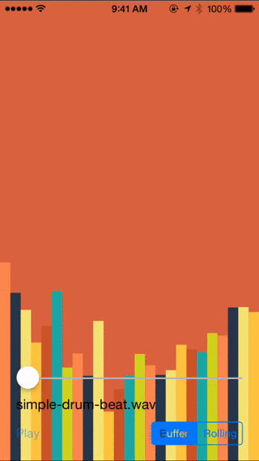
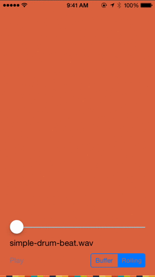

ZLHistogramAudioPlot
====================

An audio visualization view using EZAudio, inspired by [AudioCopy](https://itunes.apple.com/us/app/audiocopy/id719137307?mt=8).

Preview
---

###Buffer

###Rolling

Usage
---
Checkout the demo app for an example.

Dependencies
---
ZLHistogramAudioPlot is a subclass of `EZAudioPlot`. It requires [EZAudio](https://github.com/syedhali/EZAudio).

License
---
ZLHistogramAudioPlot is available under the MIT license. See the LICENSE file for more info.
